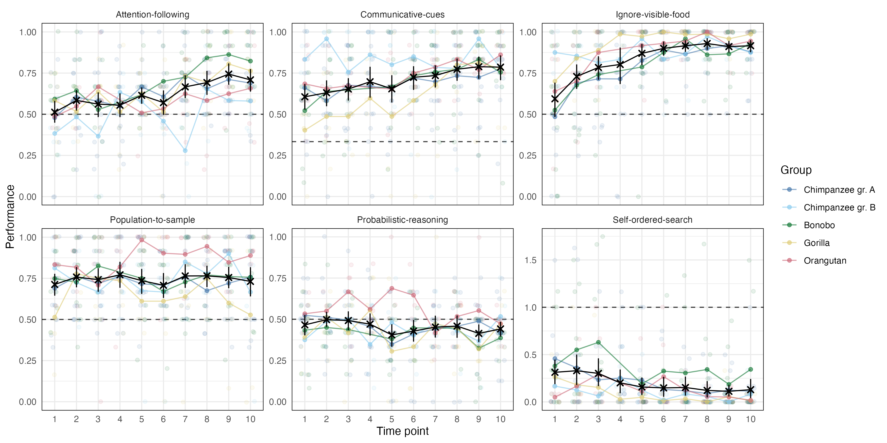

```{r , include = FALSE}
library("papaja")
r_refs("r-references.bib")
library(tidyverse)
```

# Introduction

Variation is the fodder of evolution. Individual differences in cognitive abilities are key for understanding what evolves [@volter2018comparative]. They inform us which aspects of cognition are invariant and which are more maleable. They also inform us about the broader structure of the cognitive architecture when studying relations between individual differences in different aspects of cognition. Finally, they hold the key to understanding which socio-ecological factors shape cognition during ontogeny and phylogeny. 


@matzel2017individual @boogert2018measuring


reliability: @griffin2015cognition

@shaw2017cognitive

Studying individual differnces is hard. 

@volter2022structure

@bohn2023great studied

The current study extended previous work in two important aspects. First, we study a broader range of cognitive domains including social cognition, reasoning about quantities, executive functions and inferential reasoning. This allows us to assess whether the results obtained by @bohn2023great replicate within domains and generalize to others. Second, we explored the structure of great ape cognition in more depth: we pooled the data collected here with the data from @bohn2023great to study the correlations between cognitive traits within and across domains.   

# Methods

```{r}
# read in data files
data_task <- read.csv("../data/laac2_data_task.csv")%>%
  mutate(task = recode(task,
       "population" = "Population-to-sample",
       "communication" = "Communicative-cues",
       "reasoning" = "Logical-reasoning",
       "visible_food" = "Ignore-visible-food",
       "inhibit_searched" = "Self-ordered-search",
       "attention" = "Attention-following"
  ))

data_trial <- read.csv("../data/laac2_data_trial.csv")%>%
  mutate(task = recode(task,
       "population" = "Population-to-sample",
       "communication" = "Communicative-cues",
       "reasoning" = "Logical-reasoning",
       "visible_food" = "Ignore-visible-food",
       "inhibit_searched" = "Self-ordered-search",
       "attention" = "Attention-following"
  ))
```

## Participants

```{r}
participants <- data_trial%>%
  mutate(group = as.character(group), 
         species = ifelse(grepl("chimp",group),"chimpanzee", group), 
         species = factor(species))%>%
  group_by(species)%>%
  mutate(minage = round(min(age),1),
         maxage = round(max(age),1))%>%
  group_by(species, sex, minage,maxage)%>%
  summarise(n = length(unique(subject)))


 tpn <- data_trial%>%
     mutate(group = as.character(group), 
         species = ifelse(grepl("chimp",group),"chimpanzee", group), 
         species = factor(species))%>%
   group_by(time_point)%>%
   mutate(min_date = min(date))%>%
   group_by(time_point,group,.drop=FALSE)%>%
  summarise(n = length(unique(subject)),
            date = min(min_date))%>%
  group_by(time_point)%>%
  mutate(total_n = sum(n),
         date = as.Date(as.character(min(date)), "%Y%m%d"))%>%
   group_by(group)%>%
   mutate(end = date, 
          start = lag(as.character(end)))%>%
   mutate(start = ifelse(is.na(start),"2022-04-28",start),
          start = as.Date(start, format = "%Y-%m-%d"))%>%
  ungroup()%>%
  add_row(group = "total")
```

A total of `r sum(participants$n)` great apes participated at least in one tasks at one time point. This included `r participants%>%filter(species == "bonobos")%>%pull(n)%>%sum()` Bonobos (*pan paniscus*, `r participants%>%filter(species == "bonobos", sex == "f")%>%pull(n)` females, age `r participants%>%filter(species == "bonobos", sex == "f")%>%pull(minage)` to `r participants%>%filter(species == "bonobos", sex == "f")%>%pull(maxage)` years), `r participants%>%filter(species == "chimpanzee")%>%pull(n)%>%sum()` Chimpanzees (*pan troglodytes*, `r participants%>%filter(species == "chimpanzee", sex == "f")%>%pull(n)` females, age `r participants%>%filter(species == "chimpanzee", sex == "f")%>%pull(minage)` to `r participants%>%filter(species == "chimpanzee", sex == "f")%>%pull(maxage)` years), `r participants%>%filter(species == "gorillas")%>%pull(n)%>%sum()` Gorillas (*gorilla gorilla*, `r participants%>%filter(species == "gorillas", sex == "f")%>%pull(n)` females, age `r participants%>%filter(species == "gorillas", sex == "f")%>%pull(minage)` to `r participants%>%filter(species == "gorillas", sex == "f")%>%pull(maxage)` years), and `r participants%>%filter(species == "gorillas")%>%pull(n)%>%sum()` Orangutans (*pongo abelii*, `r participants%>%filter(species == "orangs", sex == "f")%>%pull(n)` females, age `r participants%>%filter(species == "orangs", sex == "f")%>%pull(minage)` to `r participants%>%filter(species == "orangs", sex == "f")%>%pull(maxage)` years). The sample size at the different time points ranged from `r min(tpn$total_n, na.rm = T)` to `r max(tpn$total_n, na.rm = T)` for the different species (see supplementary material for details). All apes participated in cognitive research on a regular basis. Apes were housed at the Wolfgang Köhler Primate Research Center located in Zoo Leipzig, Germany. They lived in groups, with one group per species and two chimpanzee groups (group A and B). Research was noninvasive and strictly adhered to the legal requirements in Germany. Animal husbandry and research complied with the European Association of Zoos and Aquaria Minimum Standards for the Accommodation and Care of Animals in Zoos and Aquaria as well as the World Association of Zoos and Aquariums Ethical Guidelines for the Conduct of Research on Animals by Zoos and Aquariums. Participation was voluntary, all food was given in addition to the daily diet, and water was available ad libitum throughout the study. The study was approved by an internal ethics committee at the Max Planck Institute for Evolutionary Anthropology.

## Procedure

Apes were tested in familiar sleeping or observation rooms by a single experimenter. The basic setup comprised a sliding table positioned in front of a mesh or a clear plexiglas panel. The experimenter sat on a small stool and used an occluder to cover the table (see Figure \@ref(fig:setup)).

```{r setup, include = T, fig.cap = "Setup used for the six tasks. A) population-to-sample, B) logical-reasoning, C) communicative-cues, D) ignore-visible-food, E) self-ordered-search and F) attention-following. Text at the bottom shows order of task presentation and trial numbers", out.width="100%"}
knitr::include_graphics("../visuals/setup.png") 
```

The study involved a total of six cognitive tasks. These were based on published procedures in the field of comparative psychology. The original publications often include control conditions to rule out alternative, cognitively less demanding ways to solve the tasks. We did not include such controls here and only ran the experimental conditions. For each task, we refer to these papers if they want to know more about control conditions and/or a detailed discussion of the nature of the underlying cognitive mechanisms. Example videos for each task can be found in the associated online repository. In the following, we give a brief description of each task. Additional details can be found in the supplementary material.

### Attention-following

The Attention-following task was loosely modeled after @kaminski2004body. The setup consisted of two identical cups placed on the sliding table and a large opaque screen that was longer than the width of the sliding table (Supplementary Figure \@ref(fig:setup)F). The experimenter placed both cups on the table and showed the ape that they were empty. Then, the experimenter baited both cups in view of the ape and placed the opaque screen in the center between the two cups, perpendicular to the mesh. Next, the experimenter moved to one side and looked at the cup in front of them. Then, the experimenter pushed the sliding table forward and the ape was allowed to choose one of the cups by pointing at it. If the ape chose the cup that the experimenter was looking at, they received the food item. If they choose the other cup, they did not. We coded whether the ape chose the side the experimenter was looking at (correct choice) or not. Apes received twelve trials. The side at which the experimenter looked was counterbalanced with same number of looks to each side and looks to the same side not more than two times in a row. We assumed that apes follow the experimenters focus of attention to determine whether or not their request could be seen and thus be successful.

### Communicative-cues

This task was modeled after @schmid2017great. Three identical cups were placed equidistantly on a sliding table directly in front of the ape (Figure \@ref(fig:setup)C). In the beginning of a trial, the experimenter showed the ape that all cups are empty. After placing an occluder between the subject and the cups, the experimenter held up one food item and moved it behind the occluder, visiting all three cups but baiting only one. Next, the occluder was lifted and E looked at the ape (ostensive cue), called the name, and looked at one of the cups, while holding on to it with one hand and tapping it with the other (continuous looking, 3 times tapping). Finally, the experimenter pushed the sliding table forward for the ape to make a choice. If the ape chose the baited cup, they received the reward – if not, not. We coded as correct choice if the ape chose the indicated cup. Apes received twelve trials. The location of the indicated cup was counterbalanced, with each cup being the target equally often and the same target not more than two times in a row. We assumed that apes use the experimenter's communicative cues to determine where the food is hidden.

### Ignore-visible-food

The task was modeled after @volter2022inhibitory. The task involved two opaque cups with an additional, sealed but transparent, compartment attached to the front of each cup (facing the ape). For one cup, the compartment contained a preferred food item that was clearly visible, for the other cup, the compartment was empty (Figure \@ref(fig:setup)D). In the beginning of the trial, the two cups were placed upside down on the sliding table so that the ape could see that the opaque compartments of both cups were empty. Next, the experimenter baited one of the cups in full view of the subject. In non-conflict trials, the baited cup was the cup with the food item in the transparent compartment. In conflict trials, the baited cup was the cup with the empty compartment. After baiting the experimenter pushed the sliding table forwards and the ape could chose by pointing. If the baited cup was chosen, the ape received the food. Apes received 14 trials, twelve conflict trials and two non-conflict trials (1st and 8th trial). Only conflict trials were analyzed. The location of the cup with the baited compartment was counterbalanced, with the cup not being in the same location more than twice in a row. We assumed that apes need to inhibit selecting the visible food item and instead use their short-term memory to remember where the food was hidden. 

### Logical-reasoning

The task was modeled after @hanus2014maths. Three identical cups were presented side-by-side on a sliding table, with the cup in the middle sometimes positioned closer to the left cup and sometimes closer to the right. (Supplementary Figure \@ref(fig:setup)B). Two half-open boxes served as occluders to block the ape’s view when shuffling the cups. Each trial started by showing the ape that all three cups (one on one side of the table, two on the other) were empty. After placing the occluders over both sides of the table, the experimenter put one piece of food on top of each occluder. Next, the experimenter hid each piece of food under the cup(s) behind the occluders. In case of the occluder with the two cups, the food was randomly placed under one of the two cups while both cups were visited and even shuffled. Finally, both occluders were lifted and the table pushed forwards, allowing the ape to choose one of the three cups, from which they then received the content. We coded whether the ape chose the certain cup (i.e. the cup from the side of the table with only one cup). Apes received 12 trials. The side with one cup was counterbalanced, with the same constellation appearing not more than two times in a row on the same side. We assumed that apes would infer that the cup from the tray with only one cup certainly contains food while the other cups contain food only in 50% of cases.  

### Population-to-sample

The task was modeled after @eckert2018intuitive. During the test, apes saw two transparent buckets filled with pellets and carrot pieces (the carrot pieces had roughly the same size and shape as the pellets). Each bucket contained 80 food items. The distribution of pellets to carrot pieces was 4:1 in bucket A, and 1:4 in bucket B. Pellets are preferred food items in comparison to carrots. The experimenter placed both buckets on a table, one left, one right (Figure \@ref(fig:setup)A). In the beginning of a trial, the experimenter picked up the bucket on the right side, tilted it forward so the ape could see inside, placed it back on the table and turned it around 360°. The same procedure was repeated with the other bucket. Next, the experimenter looked at the ceiling, inserted each hand in the bucket in front of it and drew one item from the bucket without the ape seeing which type (E picked always of the majority type). The food items remained hidden in the experimenter's fists. Next, the experimenter extended the arms (in parallel) towards the ape who was then allowed to make a choice by pointing to one of the fists. The ape received the chosen sample. In half of the trials, the experimenter crossed arms when moving the fists towards the ape to ensure that the apes made a choice between samples and not just chose the side where the favorable population was still visible. In between trials, the buckets were refilled to restore the original distributions. Apes received twelve trials. We coded whether the ape chose the sample from the population with the higher number of high quality food items. The location of the buckets (left and right) was counterbalanced, with the buckets in the same location no more than two times in a row. The crossing of the hands was also counterbalanced with no more than two crossings in a row. We assumed that apes reasoned about the probability of the sample being a high quality item based on observing the ratio in the population.

### Self-ordered-search

The task was modeled after @volter2019chimpanzees [see also @petrides1995impairments; @diamond1997prefrontal]. Three identical cups were placed equidistantly on a sliding table directly in front of the ape (Supplementary Figure \@ref(fig:setup)E). The experimenter baited all three cups in full view of the ape. Next, the experimenter pushed the sliding table forwards for the ape to choose one of the cups by pointing. After the choice, the table was pulled back and the ape received the food. After a 3s pause, the table was pushed forward again for a second choice. This procedure was repeated for a third choice. If the ape chose a baited cup, they received the food, if not, not. We coded the number of times the ape chose and empty cup (i.e. chose a cup they already chose before). Please note that this outcome variable differed from the other tasks in two ways: first, possible values were 0, 1, and 2 (instead of just 0 and 1) and second, a lower score indicated better performance. Apes received twelve trials. No counterbalancing was needed. We assumed that apes use their working memory abilities to remember where they had already searched and which cups still contained food.

### Predictor variables

In addition to the data from the cognitive tasks, we collected data for a range of predictor variables to predict individual differences in performance in the cognitive tasks. Predictors could either vary with the individual (stable individual characteristics: group, age sex, rearing history, and time spent in research), vary with individual and time point (variable individual characteristics: rank, sickness, and sociality), vary with group membership (group life: time spent outdoors, disturbances, and life events), or vary with the testing arrangements and thus with individual, time point and session (testing arrangements: presence of an observer, participation in other studies on the same day or since the last time point). Predictors were collected from the zoo handbook with demographic information about the apes, via a diary that the animal caretakers filled out on a daily basis, or via proximity scans of the whole group. We provide a detailed description of these variables in the supplementary material.

## Data collection

Data collection started on April 28th, 2022, lasted until October 7th, 2023 and included 10 time points. One time point meant running all tasks with all participants. Within each time point, the tasks were organized in three sessions (see Fig. \@ref(fig:setup)). Session 1 included the population-to-sample and logical-reasoning tasks, session 2 the communicative-cues and ignore-visible-food tasks and session 3 the self-ordered-search and attention-following tasks.

The interval between two time points was planned to be eight weeks. However, it was not always possible to follow this schedule so that some intervals were longer or shorter (see supplementary material for details). The order of tasks was the same for all subjects. So was the counterbalancing within each task. This exact procedure was repeated at each time point so that the results would be comparable across participants and time points. 

# Analysis, results and discussion

```{r perfplot, fig.width = 10, fig.height = 6,fig.cap = "Results from the six cognitive tasks across time points. Black crosses show mean performance at each time point across species (with 95\\% CI). The sample size varied between time points and can be found in Supplementary Figure 1. Colored dots show mean performance by species. Dashed line shows chance level performance.", out.width="100%"}

 
```
To get an overview of the results, we first visualized the data (Fig. \@ref(fig:perfplot)). Performance was consistently above chance in the communicative-cues, ignore-visible-food and population-to-sample tasks. For attention-following, this was the case only from time point 7 onward and for logical-reasoning, performance was, if anything, below chance. For the self-ordered-search task, performance was below chance but here lower values reflect better performance (i.e. systematic avoidance of the visible food item). For attention-following, ignore-visible-food, communicative-cues and self-ordered-search there was a steady improvement in performance over time. 

In the following, we link performance in the tasks across time points to latent variables representing cognitive abilities. We first ask how stable these abilities are over time and how reliably they are measured. Next, we study the correlations between different  abilities to explore the internal structure of great ape cognition. Finally, we link performance in the tasks to external predictors to shed light on the sources of individual differences in abilities. Each section uses different statistical techniques which we describe in the respective section. 

## Stability and reliability

We first asked how robust performance was on a task-level, how stable individual differences were and how reliable the measures were. We used *Structural Equation Modeling* (SEM) [@bollen1989structural; @hoyle2012handbook] to address these questions^[SEMs usually use larger sample sizes than available in the present study. @bohn2023great reported a simulation study showing that parameters could be accurately estimated using Bayesian estimation techniques and reasonable model restrictions with sample sizes comparable to one we have here. We lay out the restrictive assumptions we imposed on the parameters in the supplementary material.]. For each task we fit three types of models that addressed different questions. We provide a detailed, mathematical description of the models in the supplementary material. 

We started with a latent state (LS) model. The goal of this model is to estimate a measurement-error free latent state,representing an individuals cognitive ability, for each time point. Measurement error is captured by dividing the trials from one time point into two test-halves. Roughly speaking, the correlation between these two test-halves is an indicator of measurement precision and used to estimate measurement error (and reliability). Robustness of task-level performance can be assessed by comparing the means of latent states across subjects for the different time points. Stability of individual differences can be assessed by correlating latent states across different time points.

The temporal robustness of latent state means varied across tasks (Fig. \@ref(fig:figsem)A). In attention-following, means increased over time and were significantly different from zero at later time points (9 and 10). Communicative-cues and ignore-visible-food exhibited steady increases, though ignore-visible-food saw a late-stage decline, with the latent mean at time point 10 still significantly different from 0. Self-ordered-search showed a decrease (reduction in errors) from time point 6 onward, while latent means for logical-reasoning and population-to-sample remained stable throughout the study.

Correlations between latent states illustrated varying degrees of stability of individual differences across tasks (Fig. \@ref(fig:figsem)B). Attention-following displayed low-to-moderate correlations at early time points (before time point 7), increasing substantially thereafter. Communicative-cues, ignore-visible-food, and self-ordered-search generally showed high correlations between latent states (with time point 1 of ignore-visible-food being an exception). Population-to-sample correlations were consistently high, while logical-reasoning showed generally low, sometimes even negative, correlations, suggesting no stability across time points.

Next, we fit two types of latent state-trait (LST) models. In comparison to the LS models, these models assume that there is a single latent trait, representing an individual's stable cognitive ability, that is the same across time points. This way we can partition variation in performance on a given time point into variance due to the trait (consistency), variance due to the occasion (occasion specificity; 1 - consistency), and measurement error (used to estimate reliability). Like the latent states in the LS model, the trait in the LST model is assumed to be measurement error free [@steyer1992states; @steyer2015theory; @geiser2020longitudinal]. The first LST model we fit assumed that neither the absolute trait values nor the ranking of individuals changes over time (fixed means). This is the classic version of an LSTM. The second model allowed the absolute trait values to change over time while the ranking of individuals was fixed (varying means). Change over time according to this model is thus seen as change that is the same for all individuals. In both cases, stability of individual differences can be assessed by the proportion of variance explained by the trait (consistency). 

```{r figsem, include = T, fig.cap = "A) Latent mean estimates for each time point by task based on latent state model. Means at time point 1 are set to zero. Shape denotes whether the 95\\% CrI included zero (dashed line). The sample size varied between time points and can be found in Supplementary Fig. 1.  B) Correlations between subject-level latent state estimats for the different time points by task. C) Mean estimates from latent state-trait models with fixed and varyin means (color codeed) with 95\\% CrI. Consistency refers to the proportion of (measurement-error-free) variance in performance explained by stable trait differences. Reliability refers to the proportion of true score variance to variance in raw scores.", fig.align = "center", out.width="100%"}

knitr::include_graphics("../visuals/ls_lst.png") 

```

```{r}
lst_overview <- readRDS("../saves/lst_overview.rds")
```

Consistency estimates varied across tasks (Fig. \@ref(fig:figsem)C). In attention-following, the consistency coefficient was estimated to be `r round(lst_overview%>%filter(task == "attention", param == "consistency", type == "fixed means")%>%pull(value),2)` [Jana: possible to add 95%CrI?] for the fixed means model and `r round(lst_overview%>%filter(task == "attention", param == "consistency", type == "varying means")%>%pull(value),2)` for the varying means model, indicating that more than 90% of true inter-individual differences were attributable to stable traits. However, given the low reliability of measurement (see below), this result should be interpreted with caution. [Jana: expand what that means]. For communicative-cues, consistency estimates differed the most between models and were higher in the varying means model (`r round(lst_overview%>%filter(task == "communication", param == "consistency", type == "varying means")%>%pull(value),2)`) compared to the fixed means model (`r round(lst_overview%>%filter(task == "communication", param == "consistency", type == "fixed means")%>%pull(value),2)`). The reasons for this discrepancy is most likely the substantial change in mean performance over time in the task (see Fig. \@ref(fig:figsem)A). Ignore-visible-food showed similar consistency across models, with values of `r round(lst_overview%>%filter(task == "visible-food", param == "consistency", type == "fixed means")%>%pull(value),2)` (fixed means) and `r round(lst_overview%>%filter(task == "visible-food", param == "consistency", type == "varying means")%>%pull(value),2)` (varying means). Logical-reasoning showed a similiar pattern to attention-following: Cosistency was estimated to be high (fixed means: `r round(lst_overview%>%filter(task == "reasoning", param == "consistency", type == "fixed means")%>%pull(value),2)`; varying means: `r round(lst_overview%>%filter(task == "reasoning", param == "consistency", type == "varying means")%>%pull(value),2)`) but reliability was low so that the same restrictions for interpretation apply. Self-ordered-search and population-to-sample had high consistency estimates according to both models: `r round(lst_overview%>%filter(task == "inhibit-searched", param == "consistency", type == "fixed means")%>%pull(value),2)` (fixed means) and `r round(lst_overview%>%filter(task == "inhibit-searched", param == "consistency", type == "varying means")%>%pull(value),2)` (varying means) for self-ordered-search and `r round(lst_overview%>%filter(task == "pop-to-sample", param == "consistency", type == "fixed means")%>%pull(value),2)` (fixed means) and `r round(lst_overview%>%filter(task == "pop-to-sample", param == "consistency", type == "varying means")%>%pull(value),2)` (varying means) for population-to-sample.

Reliability of measurement also varied significantly across tasks, based on the LST models (Fig. \@ref(fig:figsem)C). For attention-following, reliability was initially low (fixed means: `r round(lst_overview%>%filter(task == "attention", param == "reliability", type == "fixed means")%>%pull(value),2)`; varying means: `r round(lst_overview%>%filter(task == "attention", param == "reliability", type == "varying means")%>%pull(value),2)`), but was substantially higher when only considering time points 7 and onward (see supplementary material). Communicative-cues showed moderate reliability (fixed means: `r round(lst_overview%>%filter(task == "communication", param == "reliability", type == "fixed means")%>%pull(value),2)`; varying means:`r round(lst_overview%>%filter(task == "communication", param == "reliability", type == "varying means")%>%pull(value),2)`). Ignore-visible-food also had moderate reliability across time points (fixed means: `r round(lst_overview%>%filter(task == "visible-food", param == "reliability", type == "fixed means")%>%pull(value),2)`; varying means: `r round(lst_overview%>%filter(task == "visible-food", param == "reliability", type == "varying means")%>%pull(value),2)`). As mentioned above, logical-reasoning exhibited very low reliability (fixed means: `r round(lst_overview%>%filter(task == "reasoning", param == "reliability", type == "fixed means")%>%pull(value),2)`; varying means: `r round(lst_overview%>%filter(task == "reasoning", param == "reliability", type == "varying means")%>%pull(value),2)`). Population-to-sample showed acceptable reliability (fixed means: `r round(lst_overview%>%filter(task == "pop-to-sample", param == "reliability", type == "fixed means")%>%pull(value),2)`; varying means: `r round(lst_overview%>%filter(task == "pop-to-sample", param == "reliability", type == "varying means")%>%pull(value),2)`). Self-ordered-search also exhibited acceptable reliability levels (fixed means: `r round(lst_overview%>%filter(task == "inhibit-searched", param == "reliability", type == "fixed means")%>%pull(value),2)`; varying means: `r round(lst_overview%>%filter(task == "inhibit-searched", param == "reliability", type == "varying means")%>%pull(value),2)`).

To summarize the SEM results, we saw that the six tasks differed substantially in what they revealed about group- and individual-level variation. What stands out is the widespread change in performance over time. For all tasks except population-to-sample and logical-reasoning we observed an improvement in performance over time. This group-level change, however, has different individual-level interpretations for the different tasks. For communicative-cues, ignore-visible-food and self-ordered-search, individual differences remained relatively stable despite the group-level change suggesting stable individual differences combined with a systematic learning effect across individuals. In contrast, for attention-following, there was little stability in individual differences at earlier time points and only towards the end emerged a more stable ordering of individuals. In combination with the low reliability at earlier time points, this suggests that at least some individuals changed their response strategy in the course of the study. The combination of low reliability, chance-level performance and low correlation of latent states for logical-reasoning suggests that this task is not suited to assess individual differences in logical reasoning abilities in great apes. It is also noteworthy that the reliability estimates are on average lower compared to a previous study testing the same individuals on different tasks [@bohn2023great]. One explanation might be the increase in performance over time. At the beginning of the study, more individuals might have chosen randomly instead of using the available information provided in the task setup and the demonstrations. By definition, random variation is not reliable. With time, more and more individuals started using the available information so that inter-individual differences in how good they are in using it could be detected. 

## Structure

To explore the structure of great ape cognition we correlated latent trait estimates for each task. In contrast to raw performance scores, these estimates take into account the reliability of measurement and are considered to be measurement-error free. @bohn2023great tested the same individuals and we therefore also include the data from tasks reported there (data from phase 2). Even though the data in the two studies was collected at different time points, we think it is justifiable to analyse them jointly because the trait estimates represent stable, time-invariant individual differences in cognitive abilities. The estimates were computed ...

Figure \@ref(fig:figcor) shows the correlations between trait estimates for the different tasks. Overall, most correlations were not significantly different from zero (i.e. the 95% CI did include zero). Because of this low average level of correlations, we decided not to explore models with higher-order factors and will only interpret the qualitative patterns. 

```{r figcor, include = T, fig.cap = "Correlations between ... trait estimates. Bold correlations have 95\\% CrI not overlapping with zero.", fig.align = "center", out.width="70%"}

knitr::include_graphics("../visuals/task_level_cor.png") 

```

Conceptually, the tasks can be clustered in the following broader domains: *social cognition* (attention-following, gaze-following, communicative-cues), *reasoning about quantities* (quantity-discrimination, population-to-sample), *executive functions* (delay-of-gratification, self-ordered-search, ignore-visible-food) and *inferential reasoning* (logical-reasoning, causal-inference, inference-by-exclusion). As a first step, we will evaluate whether we find evidence for such a clustering in the data.

There was no significant correlation between any of the social cognition tasks. Furthermore, attention-following and gaze-following did not correlate significantly with any of the other tasks and communicative-cues correlated only with causal-inference -- a result we will discuss below. Thus, and in line with previous work [@herrmann2010structure], we found no evidence for shared cognitive processes in tasks measuring different aspects of social cognition.

The two tasks measuring reasoning about quantities did correlate significantly. Both tasks require discriminating between different quantities, directly in the case of quantity-discrimination and as part of the decision making process in the case of population-to-sample. Deciding between the samples from the two populations requires discriminating between the relative quantities within each bucket from which the samples were drawn.

Within the executive functions measures, self-ordered-search and inhibit-visible-food were significantly correlated but none of the two correlated with delay-of-gratification. The significant correlation can be explained by the need to inhibit a premature response (selecting visible food or a cup that was previously rewarded) in both tasks. It has been argued that delay-of-gratification requires self control (tolerating a longer waiting time to gain a more valuable reward) over and above behavioral inhibition [@beran2015comparative]. From this point of view, individual differences in the delay-of-gratification task might be due to differences in self control and less due to differences in inhibition.    

Finally, for the three inferential reasoning measures we found a correlation between inference-by-exclusion and causal-inference. Logical-reasoning did not correlate with either (neither did it with any other task). This is not surprising given the results reported above: the observed variation in the logical-reasoning task was largely noise and did not reflect systematic individual differences. The correlation between causal-inference and inference-by-exclusion is most likely due to the fact that both tasks involve making inferences about the location of food based on reasoning about its physical properties. 

Next we turn to the correlations across domains. Perhaps the most surprising finding is the correlation between causal-inference and communicative-cues. On a closer look, the origin might be task impurity in that there are two ways to solve the causal-inference task: first, as hypothesized, by using the rattling sound to infer the location of the food. Second, by interpreting the experimenter's shaking of the cup as a communicative cue, which is very similar to the communicative-cues task. Thus, we suspect that at a least some individuals solved the task via the second route. 

Finally, there was a cluster of significant correlations between delay-of-gratification, self-ordered-search, inference-by-exclusion, causal-inference, population-to-sample and quantity discrimination. Of the 15 possible correlations, only four were non-significant. One commonality between these tasks that might -- in part -- explain this pattern is that they all benefit from sustained attention to the task. Sustained attention facilitates the processing of the experimenter's demonstrations (population-to-sample, inference-by-exclusion, causal-inference, delay-of-gratification), ones one actions on the setup (self-ordered-search) or visually complex stimuli (quantity discrimination). Tentative support for this idea comes from the analysis of relevant predictors [see @bohn2023great and below] in which `time spent in research` was selected as a relevant predictor of performance for all of these tasks except causal-inference. This predictor reflects individual's experience with experimental studies, which often involve sustained attention to distributions of food items, actions of conspecifics and/or demonstrations by experimenters. Next, we turn to the sources of the individual differences analysed here.


## Predictability

In this section, we analysed which external variables accounted for for inter- and intra-individual differences in task performance. That is, we asked which of the predictor variables described above predicted performance in the different tasks. Given the large number of predictor variables (14), this question translates to a variable selection problem: selecting a subset of variables from a larger pool. We used the projection predictive inference [@piironen2018projective] approach because it is a state-of-the-art procedure that provides an excellent trade-off between model complexity and accuracy [@piironen2017comparison; @pavone2020using]. The projection prediction approach is a two-step process: The first step consists of building the best predictive model possible, called the reference model. In our case, the reference model is a Bayesian multilevel regression model -- fit via `brms` [@R-brms_a] -- including all available predictors [@catalina2020projection]. In the second step, the goal is to replace the posterior distribution of the reference model with a simpler distribution containing fewer predictors compared to the reference model. The importance of a predictor is assessed by inspecting the mean log-predictive density (`elpd`) and root-mean-squared error (`rmse`) of models containing the predictor vs. not.

The output of the procedure is a ranking of the different predictors. That is, for each task, we get a ranking of how important a predictor is for constructing the simpler replacement distribution. In addition, we can make a qualitatively assessment of whether or not a predictor is relevant or not. In addition to the global assessment, we also inspected the projected posterior distribution of the predictors classified as relevant to see how they influenced performance. In the supplementary material we provide a detailed description of the procedure including how the different variables were handled and how the importance of each predictor was assessed.

In addition to the external predictors, the models also included a random intercept term for subject (`(1 | subject)` in `brms` notation). This predictor was handled in a special way in that it was always considered last because it would otherwise have soaked up most of the variance before the other predictors would have had a chance to explain any of it.

```{r figpred, include = T, fig.cap = "A) Predictor ranking and selection based on PPI models. Crosses mark predictors that were selected to be relevant based on the PPI models. Color shows the broader category each predictor belongs to. The x-axis is sorted by the average rank across tasks. B) Posterior model estimates for the selected predictors for each task based on data. Points show means with 95\\% Credible Interval. Color denotes task. For categorical predictors, the estimate gives the difference compared to the reference level (Gorilla for group).", fig.align = "center", out.width="100%"}

knitr::include_graphics("../visuals/pred_sum.png") 
```

Fig. \@ref(fig:figpred)A summarizes the selected predictors across tasks. For all tasks, the random intercept term improved model fit the most (not shown in Fig. \@ref(fig:figpred)A). In line with results reported by @bohn2023great, this suggests that idiosyncratic developmental processes or genetic pre-dispositions, which operate on time-scales longer than what we captured in our study, accounted for a substantial portion of the variance in cognitive abilities between individuals. 

However, for two tasks, other predictors had an comparable explanatory power -- something that was not observe in @bohn2023great. For population-to-sample, `time spent in research` improved the model fit even more than adding the random intercept at the end did. This could be interpreted that performance in this task strongly depends on having learned to pay attention to stimuli and the human experimenter. For ignore-visible-food, `time point` had an influence exceeding that of the random intercept term. We think this result reflects the strong within-task learning effect across subjects. Because performance increased substantially with time, most of the variation captured by `time point` exceeded the variation between individuals.  

For the remaining predictors, the most highly-ranked and frequently selected ones came from the group of stable individual characteristics. The big exception being `time point`, which was ranked second across tasks. This pattern aligns with the SEM results, in which we saw that most of the variance in performance could be traced back to stable trait differences between individuals. The remaining occasion specific variation was largely due to improvement over time, most likely reflecting task-specific learning processes. The remaining time-varying predictors did not account for much variation.  

The predictor selected most often was `group`. It was the only predictor that was selected as relevant for all tasks. However, differences between groups were variable in that the ranking of the groups  changed from task to task (Fig. \@ref(fig:figpred)B). For example, Gorillas performed best in ignore-visible-food and self-ordered-search, the Chimpanzee group B performed best in communicative-cues and population-to-sample and the Bonobos performed best in attention-following. This speaks against clear species or group differences in general cognitive performance. Again, the most likely explanation for group differences is an interaction between species specific dispositions and individual- / task-level developmental processes.

The predictors that were selected more than once influenced performance in variable ways (Fig. \@ref(fig:figpred)B). As mentioned above, `time point` always had a positive effect because performance increased with time. Whenever `rearing` was selected to be relevant, mother-reared individuals outperformed others. `Time spent in research` had a positive effect, suggesting that more experience with research leads to better performance, except for attention-following. The effect of `sex` was variable in that females outperformed males in population-to-sample but males outperformed females in self-ordered-search and ignore-visible-food. 

# General Discussion


no evidence for something like g contra eg [@banerjee2009general]

on an individual level, in long-lived species like primates sociality etc play littel roles. if anythin rearing history. 


# Conclusion

\newpage

# References

::: {#refs custom-style="Bibliography"}
:::
