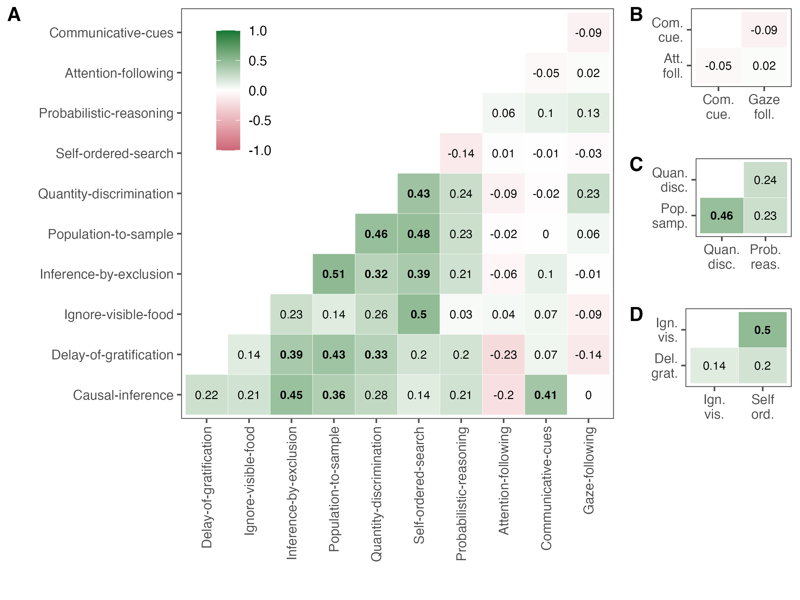
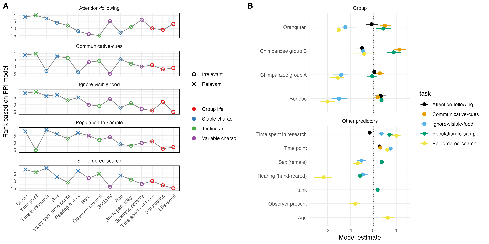

```{r , include = FALSE}
library("papaja")
r_refs("r-references.bib")
library(tidyverse)
```

# Introduction

Variation fuels evolution. Individual differences in cognitive abilities are essential for understanding what evolves [@volter2018comparative; @shaw2017cognitive; @thornton2012individual]. These differences reveal which aspects of cognition are invariant and which are malleable. They also shed light on the broader structure of the cognitive architecture by identifying relationships between different cognitive abilities. Moreover, they help identify the socio-ecological factors shaping cognition during both ontogeny and phylogeny.

Broadly speaking, great ape cognition is marked by substantial individual variability across functional domains, such as tool use, communication, social cognition, causal reasoning, and reasoning about quantities. This variability has been observed in both captive and wild settings [@herrmann2010structure; @watson2018chimpanzees; @bohn2023great; @frohlich2019ontogeny; @berdugo2023stable] and suggests significant plasticity in cognitive abilities, presumably shaped by social and ecological influences. As noted above, such individual differences can be used to study the structure of great ape cognition and its origins [@volter2018comparative].

Despite their importance, few studies have explored the broader structure of individual differences in great apes. Most work has focused on finding something akin to general intelligence or a *g*-factor [@deaner2006some; @burkart2017evolution; @reader2011evolution]. Using the Primate Cognition Test Battery (PCTB) [@herrmann2007humans], @herrmann2010structure found no evidence for a single *g*-factor in chimpanzees. Instead, they observed a bifactorial structure, with one factor linked to spatial tasks and the other to social and physical tasks. Similar findings have been reported for other primates [@fichtel2020lemur; @schmitt2012old]. By contrast, @hopkins2014chimpanzee used the PCTB to test a different sample of chimpanzees and identified a *g*-factor, which was later found to relate to measures of self-control [@beran2018self]. However, this study did not test whether the proposed structure (a single *g*-factor) fit the data well. In a subsequent re-analysis, @kaufman2019structure combined datasets collected with the PCTB and found the single *g*-factor model inadequate. Only multidimensional models accurately described the data. Beyond general cognitive abilities, @volter2022structure investigated the structure of executive functions in chimpanzees using a multi-trait, multi-method approach. Their results showed limited evidence for the structure proposed for executive functions in humans.

The existence of individual differences raises questions about their origins. Most theories about the factors influencing the emergence of complex cognitive abilities operate on a species level [@dunbar2017there; @rosati2017foraging; @henke2020linking]. Empirical studies in this tradition often compare closely related species with differing social structures or ecological pressures [@rosati2017tolerant; @joly2017comparing; @amici2008fission; @kaigaishi2019high]. Alternatively, researchers aggregate data across studies to compare species on a larger scale [@deaner2006some; @piantadosi2016extraordinary]. This approach, however, faces challenges in comparability, as data are often collected using inconsistent methods [@schubiger2020validity]. An exception is @primates2021evolution [see also @many2019establishing], which employed standardized methods to collect a large dataset on short-term memory and test species-level hypotheses. However, their results were surprising: no single socio-ecological predictor explained cognitive variation beyond phylogenetic relatedness.

In contrast, much less research has focused on the individual level [@sih2019importance]. Early work focused on the effects of enculturation—raising great apes in a human environment. Most of these studies, however, involved only one individual, making it difficult to identify the relevant aspects of experience that led to the observed changes in cognition [see @berio2023great for a recent summary]. Few studies with larger samples exist: @watson2018chimpanzees found that hand-reared chimpanzees are more likely to use social information; @bard2014emotional showed that human-reared chimpanzees excel at social cognition. @van2021chimpanzees found that chimpanzee groups with higher social tolerance (measured via co-feeding proximity) were more likely to act prosocially. Another line of research focused on personality traits [@altschul2017chimpanzee]. For example, human-rated dominance and openness to experience correlated with problem-solving abilities [@hopper2014influence], and extraversion and agreeableness with sensitivity to inequity [@brosnan2015personality; @carter2014personality]. Yet, personality is itself a latent psychological variable, and the experiences that shape differences in personality remain unclear.

To summarize: studies on individual differences in great apes are promising but rare. One reason for this shortage is the difficulty of precise individual-level measurement [@matzel2017individual; @boogert2018measuring]. To explore cognitive structures or link abilities to external variables, reliable measures are essential. Nevertheless, reliability is rarely assessed in primate cognition research [@griffin2015cognition]. For instance, the reliability of the widely used PCTB has yet to be systematically evaluated.

An exception is the work by @bohn2023great. They combined several approaches to studying individual differences while simultaneously assessing measurement quality. Over two years, they tested individuals from four great ape species on a variety of cognitive tasks. They found that most—but not all—tasks reliably measured individual differences. Stable cognitive differences were linked to long-term differences in experiences. However, due to the small number of tasks, this study offered only limited insights into the structure of individual differences.

The present study builds on @bohn2023great by addressing two key gaps. First, we broadened the range of cognitive domains studied, including social cognition, reasoning about quantities, executive functions, and inferential reasoning. This approach allows us to test whether their findings replicate within these domains and generalize to others. Second, by pooling data from both studies, we explored the correlations between cognitive traits within and across domains, providing a deeper analysis of the structure of great ape cognition.

# Methods

the study design and analysis plan were pre-registered at: https://osf.io/ycsjn. All data files and analysis scripts can be found in the associated online repository (https://github.com/ccp-eva/laac2). The supplementary material provides additional details on the statistical analysis and the results.

```{r}
# read in data files
data_task <- read.csv("../data/laac2_data_task.csv")%>%
  mutate(task = recode(task,
       "population" = "Population-to-sample",
       "communication" = "Communicative-cues",
       "reasoning" = "Probabilistic-reasoning",
       "visible_food" = "Ignore-visible-food",
       "inhibit_searched" = "Self-ordered-search",
       "attention" = "Attention-following"
  ))

data_trial <- read.csv("../data/laac2_data_trial.csv")%>%
  mutate(task = recode(task,
       "population" = "Population-to-sample",
       "communication" = "Communicative-cues",
       "reasoning" = "Probabilistic-reasoning",
       "visible_food" = "Ignore-visible-food",
       "inhibit_searched" = "Self-ordered-search",
       "attention" = "Attention-following"
  ))
```

## Participants

```{r}
participants <- data_trial%>%
  mutate(group = as.character(group), 
         species = ifelse(grepl("chimp",group),"chimpanzee", group), 
         species = factor(species))%>%
  group_by(species)%>%
  mutate(minage = round(min(age),1),
         maxage = round(max(age),1))%>%
  group_by(species, sex, minage,maxage)%>%
  summarise(n = length(unique(subject)))


 tpn <- data_trial%>%
     mutate(group = as.character(group), 
         species = ifelse(grepl("chimp",group),"chimpanzee", group), 
         species = factor(species))%>%
   group_by(time_point)%>%
   mutate(min_date = min(date))%>%
   group_by(time_point,group,.drop=FALSE)%>%
  summarise(n = length(unique(subject)),
            date = min(min_date))%>%
  group_by(time_point)%>%
  mutate(total_n = sum(n),
         date = as.Date(as.character(min(date)), "%Y%m%d"))%>%
   group_by(group)%>%
   mutate(end = date, 
          start = lag(as.character(end)))%>%
   mutate(start = ifelse(is.na(start),"2022-04-28",start),
          start = as.Date(start, format = "%Y-%m-%d"))%>%
  ungroup()%>%
  add_row(group = "total")
```

A total of `r sum(participants$n)` great apes participated at least in one tasks at one time point. This included `r participants%>%filter(species == "bonobos")%>%pull(n)%>%sum()` Bonobos (*pan paniscus*, `r participants%>%filter(species == "bonobos", sex == "f")%>%pull(n)` females, age `r participants%>%filter(species == "bonobos", sex == "f")%>%pull(minage)` to `r participants%>%filter(species == "bonobos", sex == "f")%>%pull(maxage)` years), `r participants%>%filter(species == "chimpanzee")%>%pull(n)%>%sum()` Chimpanzees (*pan troglodytes*, `r participants%>%filter(species == "chimpanzee", sex == "f")%>%pull(n)` females, age `r participants%>%filter(species == "chimpanzee", sex == "f")%>%pull(minage)` to `r participants%>%filter(species == "chimpanzee", sex == "f")%>%pull(maxage)` years), `r participants%>%filter(species == "gorillas")%>%pull(n)%>%sum()` Gorillas (*gorilla gorilla*, `r participants%>%filter(species == "gorillas", sex == "f")%>%pull(n)` females, age `r participants%>%filter(species == "gorillas", sex == "f")%>%pull(minage)` to `r participants%>%filter(species == "gorillas", sex == "f")%>%pull(maxage)` years), and `r participants%>%filter(species == "gorillas")%>%pull(n)%>%sum()` Orangutans (*pongo abelii*, `r participants%>%filter(species == "orangs", sex == "f")%>%pull(n)` females, age `r participants%>%filter(species == "orangs", sex == "f")%>%pull(minage)` to `r participants%>%filter(species == "orangs", sex == "f")%>%pull(maxage)` years). The sample size at the different time points ranged from `r min(tpn$total_n, na.rm = T)` to `r max(tpn$total_n, na.rm = T)` for the different species (see supplementary material for details). All apes participated in cognitive research on a regular basis. Apes were housed at the Wolfgang Köhler Primate Research Center located in Zoo Leipzig, Germany. They lived in groups, with one group per species and two chimpanzee groups (group A and B). Research was noninvasive and strictly adhered to the legal requirements in Germany. Animal husbandry and research complied with the European Association of Zoos and Aquaria Minimum Standards for the Accommodation and Care of Animals in Zoos and Aquaria as well as the World Association of Zoos and Aquariums Ethical Guidelines for the Conduct of Research on Animals by Zoos and Aquariums. Participation was voluntary, all food was given in addition to the daily diet, and water was available ad libitum throughout the study. The study was approved by an internal ethics committee at the Max Planck Institute for Evolutionary Anthropology.

## Procedure

Apes were tested in familiar sleeping or observation rooms by a single experimenter. The basic setup comprised a sliding table positioned in front of a mesh or a clear plexiglas panel. The experimenter sat on a small stool and used an occluder to cover the table (see Figure \@ref(fig:setup)).

```{r setup, include = T, fig.cap = "Setup used for the six tasks. A) population-to-sample, B) probabilistic-reasoning, C) communicative-cues, D) ignore-visible-food, E) self-ordered-search and F) attention-following. Text at the bottom shows order of task presentation and trial numbers", out.width="100%"}
knitr::include_graphics("../visuals/setup.png") 
```

```{r}
reli_summary <- readRDS("../saves/reli_summary.rds")
```

The study involved a total of six cognitive tasks. These were based on published procedures in the field of comparative psychology. The original publications often include control conditions to rule out alternative, cognitively less demanding ways to solve the tasks. We did not include such controls here and only ran the experimental conditions. For each task, we refer to these papers to learn more about control conditions and/or a detailed discussion of the nature of the presumed underlying cognitive mechanisms. Example videos for each task can be found in the associated online repository (https://github.com/ccp-eva/laac2/tree/main/videos). A second coder, unfamiliar to the purpose of the study, coded 20% of all time points for all tasks. Inter-rater reliability was excellent (lowest proportion of agreement = `r round(min(reli_summary$match),2)` for population-to-sample, lowest $\kappa$ = `r round(min(reli_summary$kappa),2)` for ignore-visible-food). Additional details can be found in the supplementary material.

### Attention-following

The Attention-following task was loosely modeled after @kaminski2004body. The setup consisted of two identical cups placed on the sliding table and a large opaque screen that was longer than the width of the sliding table (Supplementary Figure \@ref(fig:setup)F). The experimenter placed both cups on the table and showed the ape that they were empty. Then, the experimenter baited both cups in view of the ape and placed the opaque screen in the center between the two cups, perpendicular to the mesh. Next, the experimenter moved to one side and looked at the cup in front of them. Then, the experimenter pushed the sliding table forward and the ape was allowed to choose one of the cups by pointing at it. If the ape chose the cup that the experimenter was looking at, they received the food item. If they chose the other cup, they did not. We coded whether the ape chose the side the experimenter was looking at (correct choice) or not. Apes received twelve trials. The side at which the experimenter looked was counterbalanced with the same number of looks to each side and looks to the same side not more than two times in a row. We assumed that apes follow the experimenter's focus of attention to determine whether or not their request could be seen and thus be successful.

### Communicative-cues

This task was modeled after @schmid2017great. Three identical cups were placed equidistantly on a sliding table directly in front of the ape (Figure \@ref(fig:setup)C). In the beginning of a trial, the experimenter showed the ape that all cups are empty. After placing an occluder between the subject and the cups, the experimenter held up one food item and moved it behind the occluder, visiting all three cups but baiting only one. Next, the occluder was lifted and E looked at the ape (ostensive cue), called the ape's name, and looked at one of the cups, while holding on to it with one hand and tapping it with the other (continuous looking, 3 times tapping). Finally, the experimenter pushed the sliding table forward for the ape to make a choice. If the ape chose the baited cup, they received the reward – if not, not. We coded as correct choice if the ape chose the indicated cup. Apes received twelve trials. The location of the indicated cup was counterbalanced, with each cup being the target equally often and the same target not more than two times in a row. We assumed that apes use the experimenter's communicative cues to determine where the food is hidden.

### Ignore-visible-food

The task was modeled after @volter2022inhibitory. The task involved two opaque cups with an additional, sealed but transparent, compartment attached to the front of each cup (facing the ape). For one cup, the compartment contained a preferred food item that was clearly visible, for the other cup, the compartment was empty (Figure \@ref(fig:setup)D). In the beginning of the trial, the two cups were placed upside down on the sliding table so that the ape could see that the opaque compartments of both cups were empty. Next, the experimenter baited one of the cups in full view of the subject. In non-conflict trials, the baited cup was the cup with the food item in the transparent compartment. In conflict trials, the baited cup was the cup with the empty compartment. After baiting the experimenter pushed the sliding table forwards and the ape could choose by pointing. If the baited cup was chosen, the ape received the food. Apes received 14 trials, twelve conflict trials and two non-conflict trials (1st and 8th trial). Only conflict trials were analyzed. The location of the cup with the baited compartment was counterbalanced, with the cup not being in the same location more than two times in a row. We assumed that apes inhibit selecting the visible food item and instead use their short-term memory to remember where the food was hidden.

### Probabilistic-reasoning

The task was modeled after @hanus2014maths. Three identical cups were presented side-by-side on a sliding table, with the cup in the middle sometimes positioned close to the left cup and sometimes close to the right. (Supplementary Figure \@ref(fig:setup)B). Two half-open boxes served as occluders to block the ape’s view when shuffling the cups. Each trial started by showing the ape that all three cups (one on one side of the table, two on the other) were empty. After placing the occluders over both sides of the table, thereby covering two cups on one side and one cup on the other, the experimenter put one piece of food on top of each occluder. Next, the experimenter hid each piece of food under the cup(s) behind the occluders. In case of the occluder with the two cups, the food was randomly placed under one of the two cups while both cups were visited and even shuffled. Finally, both occluders were lifted and the table pushed forwards, allowing the ape to choose one of the three cups, from which they then received the content. We coded whether the ape chose the certain cup (i.e. the cup from the side of the table with only one cup). Apes received 12 trials. The side with one cup was counterbalanced, with the same constellation appearing not more than two times in a row on the same side. We assumed that apes would infer that the cup from the tray with only one cup certainly contains food while the other cups contain food only in 50% of cases. 

### Population-to-sample

The task was modeled after @rakoczy2014apes [see also @eckert2018intuitive]. During the test, apes saw two transparent buckets filled with pellets and carrot pieces (the carrot pieces had roughly the same size and shape as the pellets). Each bucket contained 80 food items. The distribution of pellets to carrot pieces was 4:1 in bucket A, and 1:4 in bucket B. Pellets are preferred food items in comparison to carrots. The experimenter placed both buckets on a table, one left, one right (Figure \@ref(fig:setup)A). In the beginning of a trial, the experimenter picked up the bucket on the right side, tilted it forward so the ape could see inside, placed it back on the table and turned it around 360°. The same procedure was repeated with the other bucket. Next, the experimenter looked at the ceiling, inserted each hand in the bucket in front of it and drew one item from the bucket without the ape seeing which type (E picked always of the majority type). The food items remained hidden in the experimenter's fists. Next, the experimenter extended the arms (in parallel) towards the ape who was then allowed to make a choice by pointing to one of the fists. The ape received the chosen sample. In half of the trials, the experimenter crossed arms when moving the fists towards the ape to ensure that the apes made a choice between samples and not just chose the side where the favorable population (bucket) was still visible. In between trials, the buckets were refilled to restore the original distributions. Apes received twelve trials. We coded whether the ape chose the sample from the population with the higher number of preferred food items. The location of the buckets (left and right) was counterbalanced, with the buckets in the same location no more than two times in a row. The crossing of the hands was also counterbalanced with no more than two crossings in a row. We assumed that apes reasoned about the probability of the sample being a preferred item based on observing the ratio in the population.

### Self-ordered-search

The task was modeled after @volter2019chimpanzees [see also @petrides1995impairments; @diamond1997prefrontal]. Three identical cups were placed equidistantly on a sliding table directly in front of the ape (Supplementary Figure \@ref(fig:setup)E). The experimenter baited all three cups in full view of the ape. Next, the experimenter pushed the sliding table forwards for the ape to choose one of the cups by pointing. After the choice, the table was pulled back and the ape received the food. After a 3s pause, the table was pushed forward again for a second choice. This procedure was repeated for a third choice. If the ape chose a baited cup, they received the food, if not, not. We coded the number of times the ape chose an empty cup (i.e. chose a cup they already chose before). Please note that this outcome variable differed from the other tasks in two ways: first, possible values were 0, 1, and 2 (instead of just 0 and 1) and second, a lower score indicated better performance. Apes received twelve trials. No counterbalancing was needed. We assumed that apes use their working memory abilities to remember where they had already searched and which cups still contained food.

### Predictor variables

In addition to the data from the cognitive tasks, we collected data for a range of predictor variables to predict individual differences in performance in the cognitive tasks. Predictors could either vary with the individual (stable individual characteristics: group, age, sex, rearing history, and time spent in research), vary with individual and time point (variable individual characteristics: rank, sickness, and sociality), vary with group membership (group life: time spent outdoors, disturbances, and life events), or vary with the testing arrangements and thus with individual, time point and session (testing arrangements: presence of an observer, participation in other studies on the same day and since the last time point). Predictors were collected from the zoo handbook with demographic information about the apes, via a diary that the animal caretakers filled out on a daily basis, or via proximity scans of the whole group. We provide a detailed description of these variables in the supplementary material.

## Data collection

Data collection started on April 28th, 2022, lasted until October 7th, 2023 and included 10 time points. One time point meant running all tasks with all participants. Within each time point, the tasks were organized in three sessions (see Fig. \@ref(fig:setup)), which usually took place on three consecutive days. Session 1 included the population-to-sample and probabilistic-reasoning tasks, session 2 the communicative-cues and ignore-visible-food tasks and session 3 the self-ordered-search and attention-following tasks.

The interval between two time points was planned to be eight weeks. However, it was not always possible to follow this schedule so that some intervals were slightly longer or shorter (see supplementary material for details). The order of tasks was the same for all subjects. So was the counterbalancing within each task. This exact procedure was repeated at each time point so that the results would be comparable across participants and time points. 

# Analysis, results and discussion

```{r perfplot, fig.width = 10, fig.height = 6,fig.cap = "Results from the six cognitive tasks across time points. Black crosses show mean performance at each time point across species (with 95\\% CI). The sample size varied between time points and can be found in Supplementary Figure 1. Colored dots show mean performance by species. Dashed line shows chance level performance.", out.width="100%"}

knitr::include_graphics("../visuals/perf.png") 
```
To get an overview of the results, we first visualized the data (Fig. \@ref(fig:perfplot)). Group-level performance was consistently above chance in the communicative-cues, ignore-visible-food and population-to-sample tasks. For attention-following, this was the case only from time point 7 onward and for probabilistic-reasoning, performance was, if anything, below chance. For the self-ordered-search task, performance was below chance but here lower values reflect better performance (i.e. systematic avoidance of the visible food item). For attention-following, ignore-visible-food, communicative-cues and self-ordered-search there was a steady improvement in performance over time. 

In the following, we link performance in the tasks across time points to latent variables representing cognitive abilities. We first ask how stable these abilities are over time and how reliably they are measured. Next, we study the correlations between different  abilities to explore the internal structure of great ape cognition. Finally, we link performance in the tasks to external predictors to shed light on the sources of individual differences in abilities. Each section uses different statistical techniques which we describe in the respective section. 

## Stability and reliability

We first asked how stable performance was on a task-level, how stable individual differences were and how reliable the measures were. We used *Structural Equation Modeling* (SEM) [@bollen1989structural; @hoyle2012handbook] to address these questions^[SEMs usually use larger sample sizes than available in the present study. @bohn2023great reported a simulation study showing that parameters could be accurately estimated using Bayesian estimation techniques and reasonable model restrictions with sample sizes comparable to the one we have here. We lay out the restrictive assumptions we imposed on the parameters in the supplementary material.]. For each task we fit two types of models that addressed different questions. We provide a detailed, mathematical description of the models in the supplementary material. 

We started with a latent state (LS) model. The goal of this model is to estimate a measurement-error free latent state,representing an individuals cognitive ability, for each time point. We divided the trials from one time point into two test-halves. Roughly speaking, the correlation between these two test-halves is an indicator of measurement precision and used to estimate measurement error (and reliability). Mean changes in task-level performance can be assessed by comparing the means of latent states across subjects for the different time points. Stability of individual differences can be assessed by correlating latent states across different time points.

The temporal pattern of latent state means varied across tasks (Fig. \@ref(fig:figsem)A). In attention-following, means increased over time and were significantly different from zero at later time points (9 and 10). Communicative-cues and ignore-visible-food exhibited steady increases, though ignore-visible-food saw a late-stage decline, with the latent mean at time point 10 still significantly different from 0. Self-ordered-search showed a decrease (reduction in errors) from time point 6 onward, while latent means for probabilistic-reasoning and population-to-sample remained stable throughout the study.

Correlations between latent states illustrated varying degrees of stability of individual differences across tasks (Fig. \@ref(fig:figsem)B). Attention-following displayed low-to-moderate correlations at early time points (before time point 7), increasing substantially thereafter. Communicative-cues, ignore-visible-food, and self-ordered-search generally showed high correlations between latent states (with time point 1 of ignore-visible-food being an exception). Population-to-sample correlations were consistently high, while probabilistic-reasoning showed generally low, sometimes even negative, correlations, suggesting no stability across time points.

Next, we fit a latent state-trait (LST) models. In comparison to the LS models, these models assume that there is a single latent trait, representing an individual's stable cognitive ability, that is the same across time points. This way we can partition variation in performance on a given time point into variance due to the trait (consistency), variance due to the occasion (occasion specificity; 1 - consistency), and measurement error (used to estimate reliability). Like the latent states in the LS model, the trait in the LST model is assumed to be measurement error free [@steyer1992states; @steyer2015theory; @geiser2020longitudinal]. Classic LST models assume that the absolute trait values do not change over time. After inspecting the data, we decided to relax this assumption to account for the mean change in performance over time. Thus, we fit LST models that allowed the absolute trait values to change over time. Change over time, however, is seen as change that is the same for all individuals. Stability of individual differences is reflected in the proportion of variance explained by the trait (consistency). 

```{r figsem, include = T, fig.cap = "A) Latent mean estimates for each time point by task based on latent state model. Means at time point 1 are set to zero. Shape denotes whether the 95\\% CrI included zero (dashed line). The sample size varied between time points and can be found in Supplementary Fig. 1.  B) Correlations between subject-level latent state estimats for the different time points by task. C) Mean estimates from latent state-trait models with fixed and varyin means (color codeed) with 95\\% CrI. Consistency refers to the proportion of (measurement-error-free) variance in performance explained by stable trait differences. Reliability refers to the proportion of true score variance to variance in raw scores.", fig.align = "center", out.width="100%"}

knitr::include_graphics("../visuals/ls_lst.png") 

```

```{r}
lst_overview <- readRDS("../saves/lst_overview.rds")
```

Consistency estimates varied across tasks (Fig. \@ref(fig:figsem)C). In attention-following, the consistency coefficient was estimated to be `r round(lst_overview%>%filter(task == "attention", param == "consistency", type == "varying means")%>%pull(value),2)` (95% CI: `r round(lst_overview%>%filter(task == "attention", param == "consistency", type == "varying means")%>%pull(lower_2.5ci),2)` - `r format(lst_overview%>%filter(task == "attention", param == "consistency", type == "varying means")%>%pull(upper_2.5ci),2)`), suggesting that almost 90% of true inter-individual differences were attributable to stable traits. However, given the low reliability of measurement (see below), this result should be interpreted with caution because the variability in responses largely reflects measurement error and only to a small extent stable differences between individuals. For communicative-cues, consistency was estimated to be `r round(lst_overview%>%filter(task == "communication", param == "consistency", type == "varying means")%>%pull(value),2)` (95% CI: `r round(lst_overview%>%filter(task == "communication", param == "consistency", type == "varying means")%>%pull(lower_2.5ci),2)` - `r round(lst_overview%>%filter(task == "communication", param == "consistency", type == "varying means")%>%pull(upper_2.5ci),2)`). That is, 77% of the variance was explained by trait differences between individuals. For ignore-visible-food, this number was at 64% (`r round(lst_overview%>%filter(task == "visible-food", param == "consistency", type == "varying means")%>%pull(value),2)`; 95% CI: `r round(lst_overview%>%filter(task == "visible-food", param == "consistency", type == "varying means")%>%pull(lower_2.5ci),2)` - `r round(lst_overview%>%filter(task == "visible-food", param == "consistency", type == "varying means")%>%pull(upper_2.5ci),2)`). Probabilistic-reasoning showed a similar pattern to attention-following: Consistency was estimated to be high (`r round(lst_overview%>%filter(task == "reasoning", param == "consistency", type == "varying means")%>%pull(value),2)`; 95% CI: `r round(lst_overview%>%filter(task == "reasoning", param == "consistency", type == "varying means")%>%pull(lower_2.5ci),2)` - `r round(lst_overview%>%filter(task == "reasoning", param == "consistency", type == "varying means")%>%pull(upper_2.5ci),2)`) but reliability was low so that the same restrictions for interpretation apply. Self-ordered-search and population-to-sample had high consistency estimates: `r round(lst_overview%>%filter(task == "inhibit-searched", param == "reliability", type == "varying means")%>%pull(value),2)` (95% CI: `r round(lst_overview%>%filter(task == "inhibit-searched", param == "reliability", type == "varying means")%>%pull(lower_2.5ci),2)` - `r round(lst_overview%>%filter(task == "inhibit-searched", param == "reliability", type == "varying means")%>%pull(upper_2.5ci),2)`) for self-ordered-search and `r round(lst_overview%>%filter(task == "pop-to-sample", param == "consistency", type == "varying means")%>%pull(value),2)` (95% CI: `r round(lst_overview%>%filter(task == "pop-to-sample", param == "consistency", type == "varying means")%>%pull(lower_2.5ci),2)` - `r round(lst_overview%>%filter(task == "pop-to-sample", param == "consistency", type == "varying means")%>%pull(upper_2.5ci),2)`) for population-to-sample.

Reliability of measurement also varied significantly across tasks, based on the LST models (Fig. \@ref(fig:figsem)C). For attention-following, reliability was initially low (`r round(lst_overview%>%filter(task == "attention", param == "reliability", type == "varying means")%>%pull(value),2)`; 95% CI: `r round(lst_overview%>%filter(task == "attention", param == "reliability", type == "varying means")%>%pull(lower_2.5ci),2)` - `r round(lst_overview%>%filter(task == "attention", param == "reliability", type == "varying means")%>%pull(upper_2.5ci),2)`), but was substantially higher when only considering time points 7 and onward (`r round(lst_overview%>%filter(task == "attention_tp7onward", param == "reliability", type == "varying means")%>%pull(value),2)`; 95% CI: `r round(lst_overview%>%filter(task == "attention_tp7onward", param == "reliability", type == "varying means")%>%pull(lower_2.5ci),2)` - `r round(lst_overview%>%filter(task == "attention_tp7onward", param == "reliability", type == "varying means")%>%pull(upper_2.5ci),2)`). Communicative-cues showed moderate reliability (`r round(lst_overview%>%filter(task == "communication", param == "reliability", type == "varying means")%>%pull(value),2)`; 95% CI: `r round(lst_overview%>%filter(task == "communication", param == "reliability", type == "varying means")%>%pull(lower_2.5ci),2)` - `r round(lst_overview%>%filter(task == "communication", param == "reliability", type == "varying means")%>%pull(upper_2.5ci),2)`). Ignore-visible-food also had moderate reliability (`r round(lst_overview%>%filter(task == "visible-food", param == "reliability", type == "varying means")%>%pull(value),2)`; 95% CI: `r round(lst_overview%>%filter(task == "visible-food", param == "reliability", type == "varying means")%>%pull(lower_2.5ci),2)` - `r round(lst_overview%>%filter(task == "visible-food", param == "reliability", type == "varying means")%>%pull(upper_2.5ci),2)`). As mentioned above, probabilistic-reasoning exhibited very low reliability (`r round(lst_overview%>%filter(task == "reasoning", param == "reliability", type == "varying means")%>%pull(value),2)`; 95% CI: `r round(lst_overview%>%filter(task == "reasoning", param == "reliability", type == "varying means")%>%pull(lower_2.5ci),2)` - `r round(lst_overview%>%filter(task == "reasoning", param == "reliability", type == "varying means")%>%pull(upper_2.5ci),2)`). Population-to-sample showed acceptable reliability (`r round(lst_overview%>%filter(task == "pop-to-sample", param == "reliability", type == "varying means")%>%pull(value),2)`; 95% CI: `r round(lst_overview%>%filter(task == "pop-to-sample", param == "reliability", type == "varying means")%>%pull(lower_2.5ci),2)` - `r round(lst_overview%>%filter(task == "pop-to-sample", param == "reliability", type == "varying means")%>%pull(upper_2.5ci),2)`). Self-ordered-search also exhibited acceptable reliability levels (`r round(lst_overview%>%filter(task == "inhibit-searched", param == "reliability", type == "varying means")%>%pull(value),2)`; 95% CI: `r round(lst_overview%>%filter(task == "inhibit-searched", param == "reliability", type == "varying means")%>%pull(lower_2.5ci),2)` - `r round(lst_overview%>%filter(task == "inhibit-searched", param == "reliability", type == "varying means")%>%pull(upper_2.5ci),2)`).

To summarize the SEM results, we saw that the six tasks differed substantially in what they revealed about group- and individual-level variation. What stands out is the widespread change in performance over time. For all tasks except population-to-sample and probabilistic-reasoning we observed an improvement in performance over time. This group-level change, however, has different individual-level interpretations for the different tasks. For communicative-cues, ignore-visible-food and self-ordered-search, individual differences remained relatively stable despite the group-level change suggesting stable individual differences combined with a systematic learning effect across individuals. In contrast, for attention-following, there was little stability in individual differences at earlier time points and only towards the end emerged a more stable ordering of individuals. In combination with the low reliability at earlier time points, this suggests that at least some individuals changed their response strategy in the course of the study. The combination of low reliability, chance-level performance and low correlation of latent states for probabilistic-reasoning suggests that this task is not suited to assess individual differences in probabilistic reasoning abilities in great apes.

It is also noteworthy that -- across tasks -- the reliability estimates are on average lower compared to a previous study testing the same individuals on different tasks [@bohn2023great]. One explanation might be the increase in performance over time, which was not observed by @bohn2023great. At the beginning of the study, more individuals might have chosen randomly instead of using the available information provided in the task setup and the demonstrations. By definition, random variation is not reliable. With time, more and more individuals started using the available information so that inter-individual differences in how good they are in using it could be detected. 

## Structure

To explore the structure of great ape cognition we correlated latent trait estimates for each task. In contrast to raw performance scores, these estimates take into account the reliability of measurement and are considered to be measurement-error free. @bohn2023great tested the same individuals and we therefore also include the data from tasks reported there (data from phase 2). Even though the data in the two studies was collected at different time points, we think it is justifiable to analyse them jointly because it is unlikely that changes in cognitive abilities (over and above task-specific training effects that apply to all individuals) occur in this time span. We saved 50 plausible values for the latent trait variables per individual and task after MCMC convergence [see @asparouhov2010bayesian], which were combined across tasks and analysed as multiple imputations, obtaining a pooled estimate per correlation with a respective standard error based on the pooling method for multiple imputations suggested by @rubin1987multiple.

Figure \@ref(fig:figcor) shows the correlations between trait estimates for the different tasks. Overall, most correlations were not significantly different from zero (i.e. the 95% CI did include zero). Because of this low average level of correlations, we decided not to explore models with higher-order factors and will only interpret specific qualitative patterns. 

```{r figcor, include = T, fig.cap = "Correlations between trait estimates. Bold correlations have 95\\% CrI not overlapping with zero. Panels show correlations between A) all, B) social cognition, C) reasoning about quantities, and D) executive functions tasks. The correlation between the two inferential reasoning tasks is not shown in a separate panel but can be found in A). Correlations involving self-ordered-search (coded as number of errors) have been multiplied by -1 so that higher values can be interpreted as better traits for all tasks.", fig.align = "center", out.width="100%"}

 

```

Conceptually, the tasks can be clustered in the following broader domains: *social cognition* (attention-following, gaze-following, communicative-cues), *reasoning about quantities* (quantity-discrimination, population-to-sample, probabilistic-reasoning), *executive functions* (delay-of-gratification, self-ordered-search, ignore-visible-food) and *inferential reasoning* (causal-inference, inference-by-exclusion). As a first step, we will evaluate whether we find evidence for such a clustering in the data.

There was no significant correlation between any of the social cognition tasks. Furthermore, attention-following and gaze-following did not correlate significantly with any of the other tasks and communicative-cues correlated only with causal-inference – a result we will discuss below. Thus, and in line with previous work [@herrmann2010structure], we found no evidence for shared cognitive processes in tasks measuring different aspects of social cognition.

For the three tasks measuring reasoning about quantities only quantity-discrimination and population-to-sample did correlate significantly. Both tasks require discriminating between different quantities, directly in the case of quantity-discrimination and as part of the decision making process in the case of population-to-sample. Deciding between the samples from the two populations requires discriminating between the relative quantities within each bucket from which the samples were drawn. Probabilistic-reasoning did not correlate with either of the other two quantity tasks (neither did it with any other task). This is not surprising given the results reported above: the observed variation in the probabilistic reasoning task was largely noise and did not reflect systematic individual differences.
 
Within the executive functions measures, self-ordered-search and inhibit-visible-food were significantly correlated but none of the two correlated with delay-of-gratification. The significant correlation can be explained by the need to inhibit a premature response (selecting visible food or a cup that was previously rewarded) in both tasks. It has been argued that delay-of-gratification requires self control (tolerating a longer waiting time to gain a more valuable reward) over and above behavioral inhibition (Beran, 2015). From this point of view, individual differences in the delay-of-gratification task might be due to differences in self control and less due to differences in inhibition.

Finally, we found a correlation between the two inferential reasoning measures, inference-by-exclusion and causal-inference. This correlation is most likely due to the fact that both tasks involve making inferences about the location of food based on reasoning about its physical properties.

Next, we turn to the correlations across domains. Perhaps the most surprising finding is the correlation between causal-inference and communicative-cues. On a closer look, the origin might be task impurity in that there are two ways to solve the causal-inference task: first, as hypothesized, by using the rattling sound to infer the location of the food. Second, by interpreting the experimenter’s shaking of the cup as a communicative cue, which is very similar to the communicative-cues task. Thus, we suspect that at a least some individuals solved the task via the second route.

Finally, when zooming out a bit, a notable cluster including all non-social tasks that reliably measured individual differences (i.e. excluding probabilistic reasoning) emerges. Out of 21 correlations, 12 were significant. All others were positive and numerically close to the significant ones. On a generous view, one might further consider that self-ordered-search and ignore-visible-food had limited variation due to ceiling effects which might have led to an underestimation of the correlations involving these tasks (6 out of 9 non-significant correlations). In sum, one might therefore speculate about commonalities between all non-social tasks. What could these be? We do not know, however, we doubt that it would be a single process shared by all the tasks. More likely is a set of processes that are shared among some of the tasks. We think the best way to find out would be to adopt a process-level perspective on all tasks and build computational cognitive models that explicate the processes involved. This approach could be constrained using the data reported here and, more importantly, it could lead to predictions about which, yet to be designed, tasks should correlate because they share a common set of processes.

## Predictability

In this section, we analysed which external variables accounted for inter- and intra-individual differences in task performance. That is, we asked which of the predictor variables described above predicted performance in the different tasks. Given the large number of predictor variables (14), this question translates to a variable selection problem: selecting a subset of variables from a larger pool. We used the projection predictive inference [@piironen2018projective] approach because it is a state-of-the-art procedure that provides an excellent trade-off between model complexity and accuracy [@piironen2017comparison; @pavone2020using]. The projection prediction approach is a two-step process: The first step consists of building the best predictive model possible, called the reference model. In our case, the reference model is a Bayesian multilevel regression model -- fit via `brms` [@R-brms_a] -- including all available predictors [@catalina2020projection]. In the second step, the goal is to replace the posterior distribution of the reference model with a simpler distribution containing fewer predictors compared to the reference model. The importance of a predictor is assessed by inspecting the mean log-predictive density (`elpd`) and root-mean-squared error (`rmse`) of models containing the predictor compared to models that lack it.

The output of the procedure is a ranking of the different predictors. That is, for each task, we get a ranking of how important a predictor is for constructing the simpler replacement distribution. In addition, we can make a qualitative assessment of whether or not a predictor is relevant or not. In addition to the global assessment, we also inspected the projected posterior distribution of the predictors classified as relevant to see how they influenced performance. In the supplementary material we provide a detailed description of the procedure including how the different variables were handled and how the importance of each predictor was assessed.

In addition to the external predictors, the models also included a random intercept term for subject (`(1 | subject)` in `brms` notation). This predictor was handled in a special way in that it was always considered last because it would otherwise have soaked up most of the variance before the other predictors would have had a chance to explain any of it.

```{r figpred, include = T, fig.cap = "A) Predictor ranking and selection based on PPI models. Crosses mark predictors that were selected to be relevant based on the PPI models. Color shows the broader category each predictor belongs to. The x-axis is sorted by the average rank across tasks. B) Posterior model estimates for the selected predictors for each task based on data. Points show means with 95\\% Credible Interval. Color denotes task. For categorical predictors, the estimate gives the difference compared to the reference level (Gorilla for group).", fig.align = "center", out.width="100%"}

 
```

Fig. \@ref(fig:figpred)A summarizes the selected predictors across tasks. For all tasks, the random intercept term improved model fit the most (not shown in Fig. \@ref(fig:figpred)A). In line with results reported by Bohn et al. (2023), this suggests that genetic predispositions and/or idiosyncratic developmental processes, which operate on time-scales longer than what we captured in our study, accounted for a substantial portion of the variance in cognitive abilities between individuals. 

However, for two tasks, other predictors had a comparable explanatory power -- something that was not observed in @bohn2023great. For population-to-sample, `time spent in research` improved the model fit even more than adding the random intercept at the end did. This could be interpreted that performance in this task strongly depends on having learned to pay attention to stimuli and the human experimenter. For ignore-visible-food, `time point` had an influence exceeding that of the random intercept term. We think this result reflects the strong within-task learning effect across subjects. Because performance increased substantially with time, most of the variation captured by `time point` exceeded the variation between individuals.  

For the remaining predictors, the most highly-ranked and frequently selected ones came from the group of stable individual characteristics. The big exception being `time point`, which was ranked second across tasks. This pattern aligns with the SEM results, in which we saw that most of the variance in performance could be traced back to stable trait differences between individuals. Mean changes in task performance were largely due to improvement over time, most likely reflecting task-specific learning processes. The remaining time-varying predictors did not account for much variation..  

The predictor selected most often was `group`. It was the only predictor that was selected as relevant for all tasks. However, differences between groups were variable in that the ranking of the groups  changed from task to task (Fig. \@ref(fig:figpred)B). For example, gorillas performed best in ignore-visible-food and self-ordered-search, the chimpanzee group B performed best in communicative-cues and population-to-sample and the bonobos performed best in attention-following. This speaks against clear species or group differences in general cognitive performance. Again, the most likely explanation for group differences is an interaction between species-specific dispositions and individual- / task-level developmental processes.

The predictors that were selected more than once influenced performance in variable ways (Fig. \@ref(fig:figpred)B). As mentioned above, `time point` always had a positive effect because performance increased with time. Whenever `rearing` was selected to be relevant, mother-reared individuals outperformed others. `Time spent in research` had a positive effect, suggesting that more experience with research [or researchers, see @damerius2017orientation] leads to better performance, except for attention-following. The effect of `sex` was variable in that females outperformed males in population-to-sample but males outperformed females in self-ordered-search and ignore-visible-food. 

# General Discussion

In the present study, we investigated the stability, structure and predictability of great ape cognition across a broad range of domains, including social cognition, reasoning about quantities, executive functions, and inferential reasoning. We repeatedly administered six tasks to a comparatively large sample of great apes a total of 10 times over a period of 1.5 years. Group-level results varied by task: while some tasks demonstrated substantial changes over time, others remained relatively stable. The tasks also differed in how reliably they measured individual differences, ranging from very poor (probabilistic-reasoning) to very good (population-to-sample, self-ordered-search). A significant portion of the observed variance in performance could be attributed to stable differences in cognitive abilities between individuals. However, these individual differences were not strongly associated across all tasks; instead most non-social tasks were correlated while social tasks correlated neither with each other nor with other tasks.. Finally, individual differences in cognitive abilities were better predicted by stable, individual-specific characteristics compared to transient aspects of everyday experience.

The observed substantial changes in performance over time highlight the plasticity of cognition in great apes. Even though individual differences were stable -- indicating that individuals improved at similar rates – our findings show that adult apes, including older individuals, are capable of learning and cognitive improvement. A case in point is the chimpanzee B group, which consisted exclusively of adults, some of whom were in their 50s. This contrasts with earlier work which suggested a decline in cognitive performance, in particular executive functions, with age [@lacreuse2020age; @lacreuse2018age; @manrique2015age]. However, earlier findings might have been driven by cohort effects in that longitudinal decline within individuals was substantially smaller compared to cross-section differences between age groups [@hopkins2021age]. In any case, this underscores the importance of longitudinal studies to study the dynamics of cognitive development, not just early but also late in life.

The tasks varied substantially in their quality of measurement. This finding emphasizes the importance of rigorously assessing measurement properties before including tasks in cognitive test batteries or collecting data from large samples with the goal of assessing individual differences [see also @cauchoix2018repeatability; @soha2019performance]. The reliability of measurement has profound implications for the conclusions that can be drawn [@fried2018measurement; @hedge2018reliability]. For instance, the probabilistic-reasoning task showed no meaningful correlations with other tasks, which might suggest that probabilistic reasoning is an isolated cognitive ability. However, the lack of correlation—paired with chance-level performance—was more likely due to the task failing to measure anything reliably, with variation in performance being predominantly noise. The communicative-cues task, on the other hand, reliably measured individual differences but did not correlate with any of the other tasks, suggesting that it does not share cognitive processes with them.

We found no evidence for a *g*-factor explaining much of the differences between individuals [contra @hopkins2014chimpanzee]. Compared to work with human participants and also to earlier ape studies [@hopkins2014chimpanzee; @herrmann2010structure; @volter2022structure], the sample we tested could be considered small. However, we collected a large number of data points for each individual, and our analytical approach explicitly accounted for measurement reliability. Thus, we believe the lack of strong correlations across tasks reflects a genuine finding rather than noise. This pattern also aligns with previous work and animal cognition research more broadly [@poirier2020general]. For example, when conducting a confirmatory factor analysis on their data, @herrmann2010structure found that less than half of the tasks in the PCTB loaded on any of the theoretically proposed factors, and only 10 of the 105 bivariate correlations were significant. @volter2022structure found that only three out of 36 bivariate correlations between executive functions tasks were significantly different from zero. Moving forward, we propose to move away from a domain-level perspective to a process-level perspective. That is, instead of classifying tasks based on their domain of application (e.g., reasoning about the physical or social world), one should identify the cognitive processes involved in a task and generate predictions about correlations between tasks based on process-level commonalities. Case in point is the correlation observed between causal-inference and communicative-cues, which can only be explained by a process-level perspective.

Finally, this study, alongside findings from @bohn2023great, highlights that the origins of individual differences in great ape cognitive abilities most likely lie deeply embedded in the ontogenetic -- and perhaps genetic -- history of individuals. Efforts to explain these differences by using easily measurable variables, such as age, sex, or rank, proved unproductive. Of these, only group emerged as a relevant predictor across all tasks. Notably, in this study, group is not synonymous with species: the two chimpanzee groups differed substantially across tasks. This underscores the importance of studying within-species variation, rather than focusing solely on between-species differences. On its own, the group variable has limited explanatory power because it encapsulates a variety of factors, including age, social dynamics and genetic differences. Altogether, these findings highlight the need for longitudinal studies that begin as early in life as possible to truly understand the developmental roots of individual differences in great ape cognition.

\newpage

# References

::: {#refs custom-style="Bibliography"}
:::
